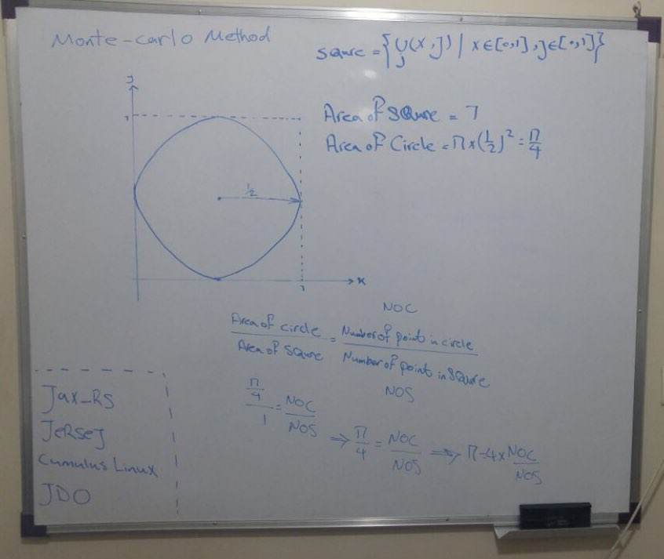

# Approximation-of-Pi-with-Monte-Carlo-Method

My 9th project was in the "Fundamentals of Programming" course when I was in the 1st semester of my bachelor's at IAUSTB. This Program approximates Pi number with Monte Carlo method.

## Monte Carlo Method
|  | 
|:--:| 
| *mone carlo*

## output
|  | 
|:--:| 
| *Output Sample*

