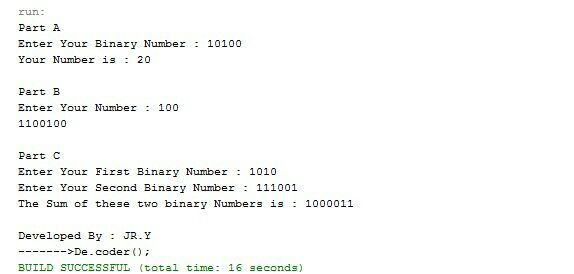

# Binaries-Calculation

My 6th project was in the "Fundamentals of Programming" course when I was in the 1st semester of my bachelor's at IAUSTB. This Program Coverts decimal to binary, binary to decimal, and adds two binaries.

## output
|  | 
|:--:| 
| *Output Sample*

