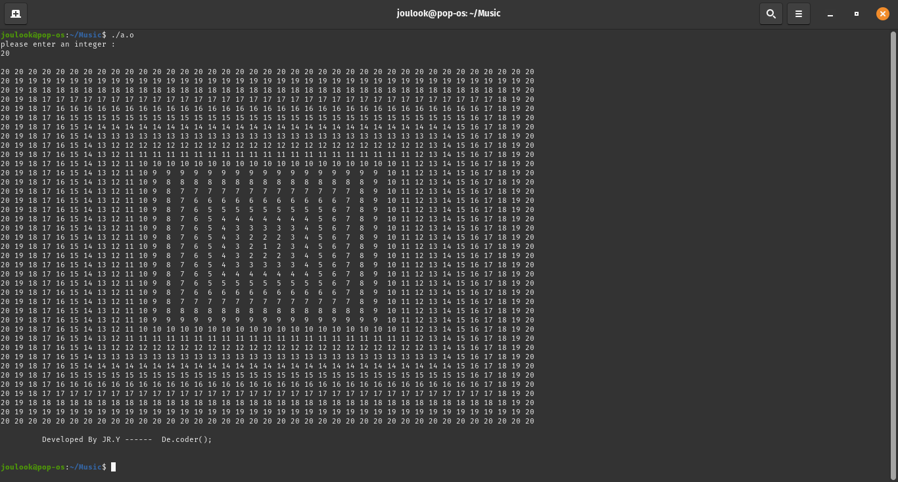

# Decreasing-Layer-Matrix

My first project in "Fundamentals of Programming" coures when i was in 1st semester of my bachelor's at IAUSTB.
This Program calculates an N*N matrix which it's out most layer is filled by the Number N and each nested layer starts to decreas this value and at the end the inner most layer is filled with 0 value.  

|  | 
|:--:| 
| *output* |
