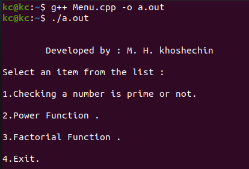
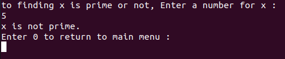
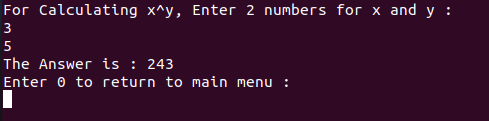
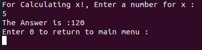

# Math-Functions-Assistant

My Second project in "Fundamentals of Programming" coures when I was in 1st semester of my bachelor's at IAUSTB. This Program has a text-based manu which can do 3 mathematics functions:
1. Finding a number is prime or not
2. Power function
3. Factorial function

|  | 
|:--:| 
| *Main Menu* |

## 1. Finding a number is prime or not

In this section you can insert a natural number and find that is prime or not

|  | 
|:--:| 
| *Finding a number is prime or not* |

## 2. Power function
In this section you can calculates x^y by inserting x and y as inputes.

|  | 
|:--:| 
| *Power function* |

## 3. Factorial function
In this section you can calculates x! by inserting x as an inpute.

|  | 
|:--:| 
| *Factorial function* |
