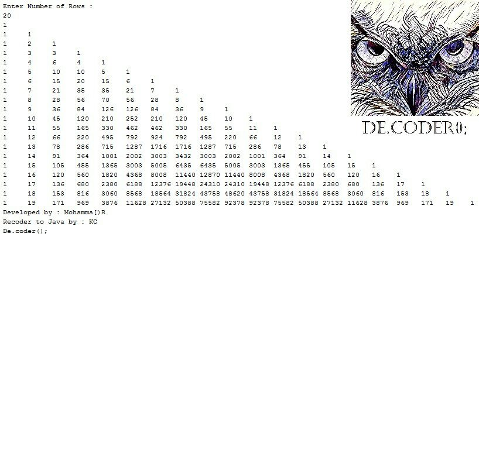

# Pascal's-Triangle

My third project in "Fundamentals of Programming" coures when I was in 1st semester of my bachelor's at IAUSTB. This Program calculates Pascal's triangle with combinatorics methods.

## Pascal's Triangle
|  | 
|:--:| 
| *Pascal Triangle*
