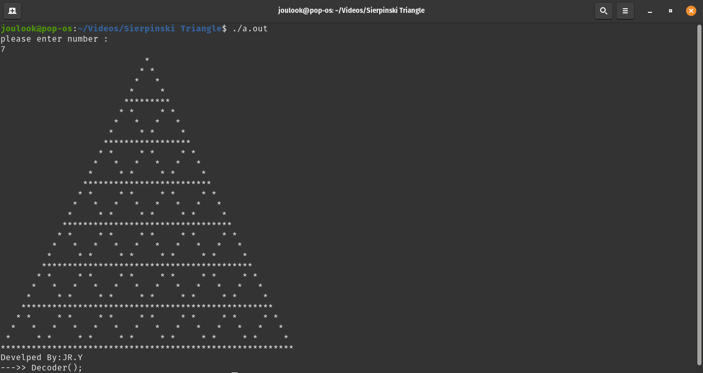

# Sierpinski-Triangle

My 8th project was in the "Fundamentals of Programming" course when I was in the 1st semester of my bachelor's at IAUSTB. This Program prints a Sierpinski triangle. 

## output
|  | 
|:--:| 
| *Output Sample*

