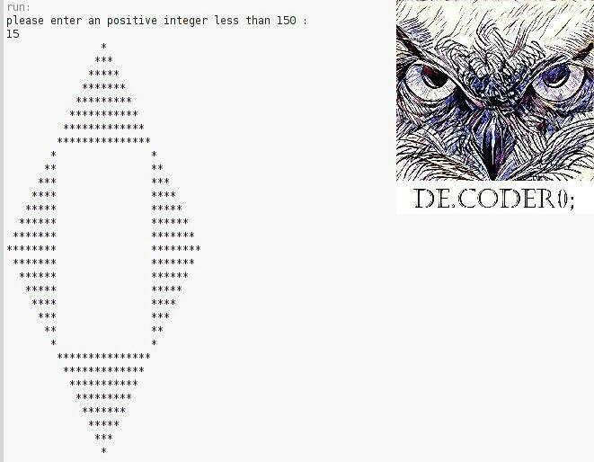

# Square-in-Diamond

My 7th project was in the "Fundamentals of Programming" course when I was in the 1st semester of my bachelor's at IAUSTB. This Program prints a diamond with a diameter (2*n)+1 that is the largest possible square enclosed within it. 

## output
|  | 
|:--:| 
| *Output Sample*

