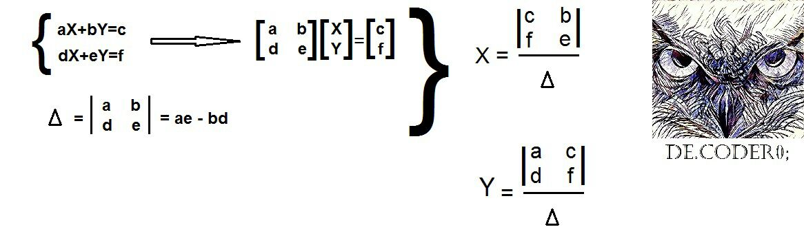
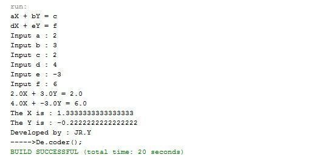

# System-of-2-Linear-Equations-in-2-Variables-Calculator

My 5th project was in the "Fundamentals of Programming" course when I was in 1st semester of my bachelor's at IAUSTB. This Program calculates System of 2 Linear Equations in 2 Variables.

## Linera equations
|  | 
|:--:| 
| *2 linear equations solving approach*

## Output
|  | 
|:--:| 
| *Output*

