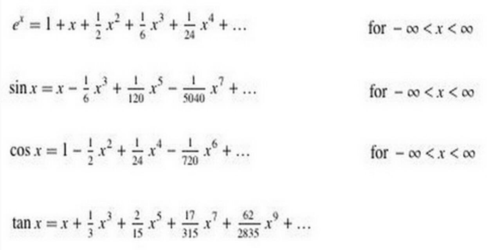
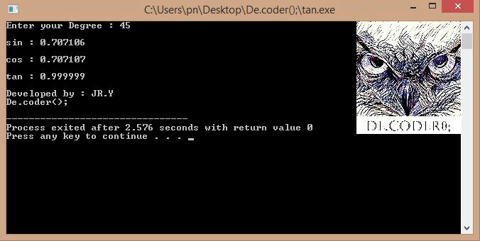

# Trigonometry-Functions-Calculations-with-Maclaurin-Series

My 4th project was in the "Fundamentals of Programming" course when I was in 1st semester of my bachelor's at IAUSTB. This Program calculates Trigonometry Functions with Maclaurin Series.

## Maclaurin Series Formula
|  | 
|:--:| 
| *Maclaurin Series*

## Trigonometry Functions Calculations
|  | 
|:--:| 
| *Output Sample*

